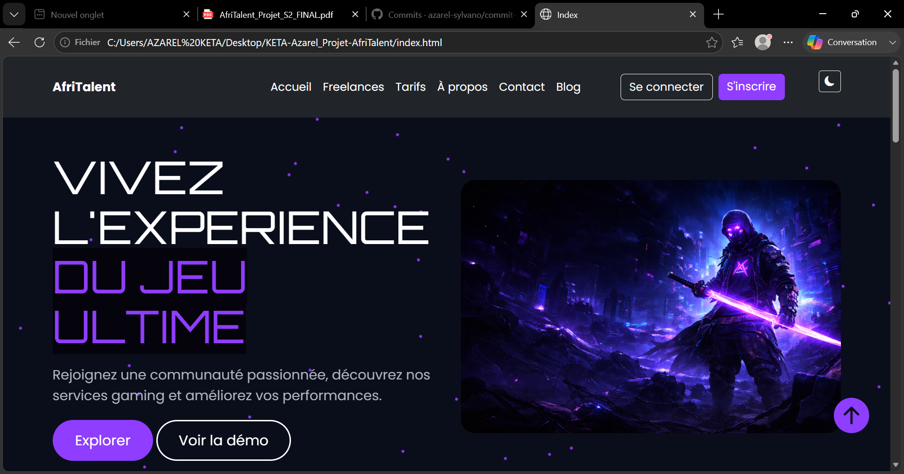
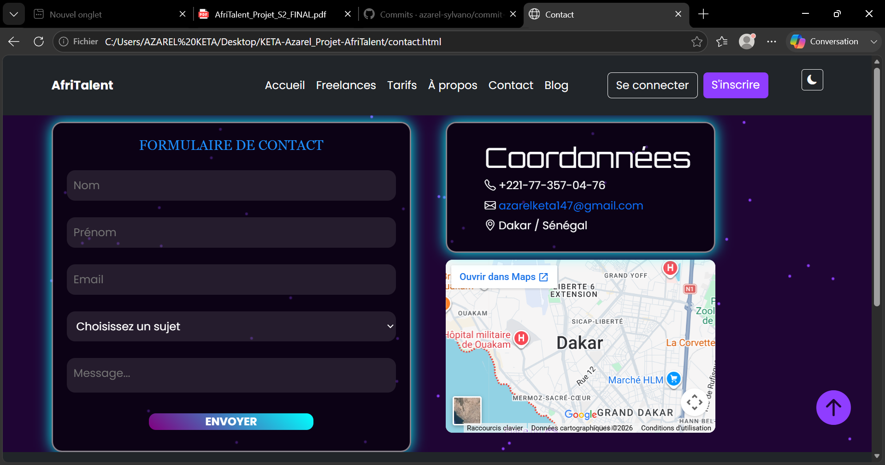

#  GAMEHAVEN

**Site vitrine dédié à l'univers du gaming**

Découvrez les dernières actualités, les univers de jeux, les tendances gaming et rejoignez une communauté de passionnés.

## Aperçu du site

### Page d'accueil

### Page Contact

##  Table des matières

- [Présentation](#présentation)
- [Objectif](#objectif)
- [Public cible](#public-cible)
- [Palette de couleurs](#palette-de-couleurs)
- [Typographies](#typographies)
- [Architecture du projet](#architecture-du-projet)
- [Technologies utilisées](#technologies-utilisées)
- [Fonctionnalités](#fonctionnalités)
- [Bootstrap & CSS avancé](#bootstrap--css-avancé)
- [JavaScript](#javascript)
- [Perspectives](#perspectives)
- [Auteur](#auteur)

## Présentation

**GAMEHAVEN** est un site web vitrine consacré à l'univers du gaming.

Le projet permet aux visiteurs de :

- Découvrir différents univers de jeux vidéo
- Consulter des informations sur les jeux populaires
- Explorer les différentes rubriques du site
- Contacter les administrateurs grâce à un formulaire
- Profiter d'une interface moderne, responsive et intuitive

Le site est entièrement responsive et s'adapte aux ordinateurs, tablettes et smartphones.

##  Objectif

Ce projet a été réalisé dans le cadre de la formation **L1CS - ISI** afin de mettre en pratique :

- HTML5
- CSS3
- JavaScript (ES6)
- Bootstrap 5
- Git & GitHub

## Public cible

| Public | Description |
|---------|-------------|
| Passionnés de jeux vidéo | Découvrir les nouveautés du gaming |
| Joueurs occasionnels | Explorer différents univers de jeux |
| Fans d'e-sport | Suivre les tendances et les compétitions |

## Palette de couleurs

| Élément | Couleur | Code |
|---------|----------|------|
| Fond principal | Noir profond | `#0A0E1A` |
| Cartes | Violet foncé | `#2D1E4E` |
| Couleur principale | Violet néon | `#8F3DFF` |
| Couleur secondaire | Doré | `#F4C63D` |
| Texte principal | Blanc cassé | `#F8F9FA` |
| Texte secondaire | Gris clair | `#ADB5BD` |

##  Typographies

| Élément | Police |
|---------|---------|
| Titres | Orbitron |
| Texte | Poppins |

##  Architecture du projet

GAMEHAVEN/
│
├── index.html
├── about.html
├── freelances.html
├── tarifs.html
├── contact.html
│
├── css/
│   └── style.css
│
├── js/
│   └── main.js
│
├── images/
│   ├── capture1.png
│   └── capture2.png
│
└── README.md

##  Technologies utilisées

- HTML5
- CSS3
- JavaScript (ES6)
- Bootstrap 5.3
- Git
- GitHub

##  Fonctionnalités

-  Navigation responsive
-  Mode clair / sombre
-  Animations au défilement
-  Validation JavaScript du formulaire
-  Filtrage dynamique
-  Navbar responsive
-  Design moderne

##  Bootstrap & CSS avancé

Le projet utilise Bootstrap 5 afin de créer :

- Une barre de navigation responsive
- Des cartes modernes
- Une grille responsive
- Des boutons stylisés
- Des formulaires ergonomiques

Le CSS personnalisé apporte :

- Des animations
- Des effets au survol
- Une palette de couleurs gaming
- Une meilleure expérience utilisateur

##  JavaScript

Le fichier `main.js` gère notamment :

- Le changement de thème (Dark / Light)
- La sauvegarde du thème
- Les animations au scroll
- La validation du formulaire
- Le filtrage dynamique

## Perspectives

Les améliorations prévues sont :

- Authentification des utilisateurs
- Base de données
- Backend Node.js
- Chat en temps réel
- Application mobile
- Tableau de bord administrateur

##  Auteur

**Azarel KETA-WAPOUTOU**

Étudiant en **Licence 1 Informatique (L1CS - ISI)**

Projet réalisé dans le cadre de la formation en développement web.

##  Démo

**Voir le site en ligne :**

https://azarelketa147.github.io/KETA-WAPOUTOU-Azarel-AfriTalent/